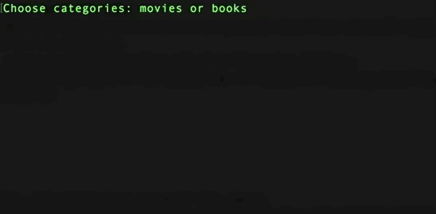

# Shrugman

Let's build another guessing game.
One player, makes up a secret word or phrase (we will use movie titles), while the other player tries to guess the word by asking what letters it contains.
However, every wrong guess brings them one step closer to losing.
To indicate how many attempts are left, instead of the usual hanging man drawing, we draw the shrug emoji. It consists of exactly 10 characters:

```bash
¯\_(:/)_/¯
```

Every wrong guess, draws one more piece of the emoji.
If the user has already guessed this letter once, ask them for another letter, instead of couting it as a wrong guess.

The secret movie title is displayed masked - every character except spaces is represented by an underscore `_`. With every correct guess, all ocurrences of the letter are revealed.

Once the game is over, print a list of all games played, and whether they were a win or a loss:

1. Braveheart - win
2. The Godfather - loss

Without adding the extra feature for asking for another round, this list will always have 1 item.

## Requirements

- Use class: Ideally your class is unaware of the `prompt` or the `console`.
- All changes re pushed to your Github repo.

## Extra Features

- Make use of [`console.clear()`](https://www.geeksforgeeks.org/node-js-console-clear-method/), so we only see the most recent state of the word and the shrugman emoji.
- Add guess categories: The user can have mutliple categories to choose from. We already have movies, let's add also books, or quotes. If they choose movies, we will ask them to guess a movie title. If they choose books, we will ask them to guess a book title.
- Ask the user to play another round with the same category.

## Optional

- Use `require` to split into separate files: you should have at least 2 files, one main file and one where the class will live.
- use [chalk](https://www.npmjs.com/package/chalk) to make things a bit more colorful 🌈

## Examples

Take a look at the examples:

When the user wins a round:


When the user loses a round:



==========================

player1 = cat
shrug = ```bash
¯\_(:/)_/¯
```

index = 0
playerGuessing = _a_

loop() {
    let guess = prompt ('guess the letter')

    if guess is correct {
        if (counterScores(playerGuessing)===0)
        console.log(congrats you win)
        break (or exit)
        playerGuessing[player1.indexOf(guess)] = guess
        console.log (playerGuessing) 
        //guess = prompt ('guess the letter')
    }
    else 
    if (its not correct) {
        if (index => shrug.length)
    }
    console.log(game over) break (exit)
}
console.log(shrug.slice(0,index))
++index 
